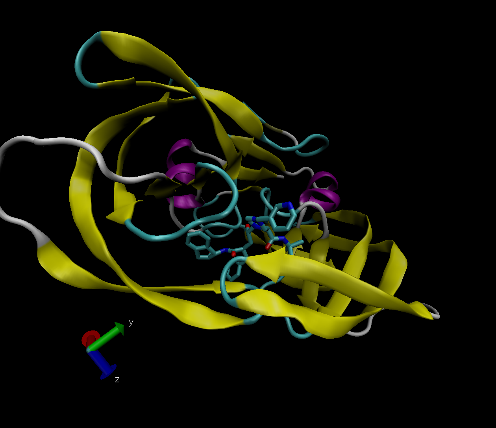
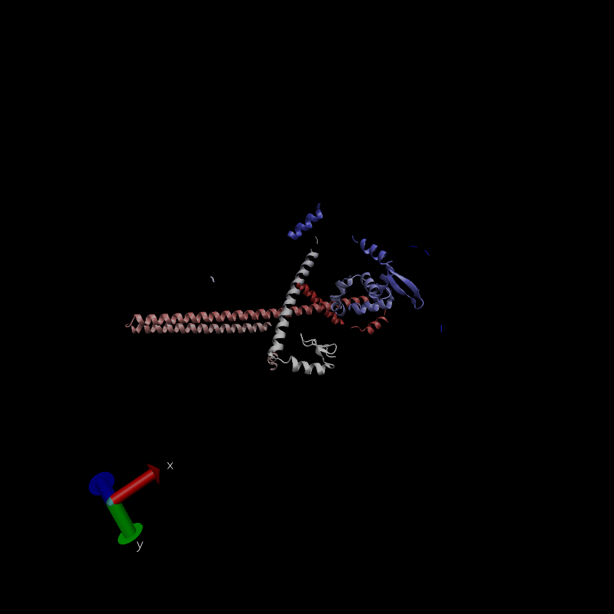

# The PDB database

The PDB is the main repository for 3D structure data of biomolecules.

Here we explore it's composition. We obtained the most recent stats from <https://www.rcsb.org/stats/summary>

## PDB Statistics
```{r}
tbl <- read.csv("Data Export Summary.csv", row.names=1)
tbl
```

> Q1: What percentage of structures in the PDB are solved by X-Ray and Electron Microscopy.

```{r}
tot.method <- colSums(tbl)
round(tot.method/tot.method["Total"] *100, digits = 3)
```

87.197% are X-ray and 5.354% are EM.

> Q2: What proportion of structures in the PDB are protein?

```{r}
ans <- tbl$Total[1]/sum(tbl$Total) *100
round(ans, 3)
```

The answer to this question is `r round(ans, 3)` % of total structures.

> Q3: Type HIV in the PDB website search box on the home page and determine how many HIV-1 protease structures are in the current PDB?
4,483

#Visualizing the HIV-1 protease structure

Here is a VMD generated image of HIV-protease, PDB code: 1hsg




## Bio3D package for structural bioinformatics

We will load the bio3d package.

```{r}
# install.packages("bio3d")
library(bio3d)

pdb <- read.pdb("1hsg")
pdb
```

> Q7: How many amino acid residues are there in this pdb object? 
198

> Q8: Name one of the two non-protein residues?
HOH or MK1

> Q9: How many protein chains are in this structure?
2

```{r}
head(pdb$atom)
```

```{r}
#install.packages("bio3d")
#install.packages("ggplot2")
#install.packages("ggrepel")
#install.packages("devtools")
#install.packages("BiocManager")

#BiocManager::install("msa")
#devtools::install_bitbucket("Grantlab/bio3d-view")
```


> Q10. Which of the packages above is found only on BioConductor and not CRAN? 
msa

> Q11. Which of the above packages is not found on BioConductor or CRAN?: 
bio3d-view

> Q12. True or False? Functions from the devtools package can be used to install packages from GitHub and BitBucket? 
True


Extract the sequence for ADK:

```{r}
aa <- get.seq("1ake_A")
aa
```

> Q13. How many amino acids are in this sequence, i.e. how long is this sequence? 
214


```{r}
blast <- blast.pdb(aa)
```

```{r}
hits <- plot(blast)
```

```{r}
head(hits$pdb.id)
```

## Normal mode analysis (NMA)

```{r}
pdb <- read.pdb("1ake")
pdb
```

Trim to Chain A only.
```{r}
chain <- trim.pdb(pdb, chain="A")
chain
```

Run a bioinformatics method to predict the flexibility and "functional motions" of this protein chain.

```{r}
modes <- nma(chain)
```

```{r}
plot(modes)
```

```{r}
m7 <- mktrj.nma(modes, mode=7, file="mode_7.pdb")
```

```{r}
pdb <- read.pdb("1ake")
chain <- trim.pdb(pdb, chain="A")
modes <- nma(chain)
mktrj.nma(modes, mode=7, file="mode_7.pdb")
```


Find A Gene FOXP2 Protein Image



